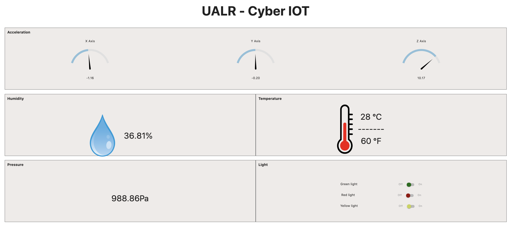

# UALR Google Cloud Project - ioT

This Flask application is part of a bigger ioT project of the for cybersecurity lab.

The application is deploy on a VM (Ubuntu 14.04) instance in the Google Cloud Platform 
and display real time data (Firebase real-time database) about an ioT device of the lab. Telemetry data are published 
to the Pub/Sub section of the GCP through MQTT protocol.

Firebase cloud functions trigger those publications and update the firebase database. Data on the client side are refresh 
every second to represent the iot state.

